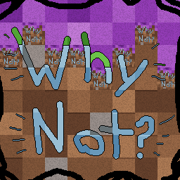

# Why Not?

A Minecraft Bedrock Addon adding a lot of random stuff. 
This Addon could be called by some as a "Shitpost" and for other as a "Masterpiece" but what matters is the concept, this is primarilly an Addon where I will add practically anything that I want or find funny at the moment, so it will not have consistent levels of quality.

## Features
### Ya no hay camino que recorra tu pasado
With you can get a rickroll-like meme with 12.5% chance when you open a chest or villager menu. For context this is a meme where a baby dinosaur called "Bebe Sinclair" sings a piece of a song, this meme popped off on Instagram Reels for me and the sheer amount of times a "regular" video got me playing this meme gave me the idea to add it (Well my brother but I thought of it before), yes, this is a pretty useless and shitpost-y addition but I dont care.

### Light Fruit
I added the light fruit from Blox Fruits (Roblox Experience) to the Addon, when you eat it you permanently become a fruit holder (like in One Piece) and get extra abilities.
#### Light Spear
You get a Light Spear that is a type of sword better than an enchanted netherite sword, while holding it you get access to all new abilities.
#### Air Jump
If you are airborne you can Air Jump up to ten times, if you air jump you will negate fall damage until grounded
#### Dash
You get the abilty to dash by sneaking, this sends you forward, it has no max use count and does not cancel fall damage.
#### F Ability - Light Flight
If you are sneaking then hold space you will start a Light flight, you go faster if your health-bar is full, you bounce of blocks, and you turn in ~45deg ranges (like in Blox Fruits), it has no max duration, only a cooldown, when you are flying you can release sneak, you will stop only after you release space.
#### Z Ability - Light Bow (Unpolished)
If you are sneaking and you use the spear (right click) you will charge up to three explosive light shots, the ability cancels gravity and movement until relesed.
#### X Ability - Light Beam (Unpolished)
If you use the spear (right click) you will shoot a light beam that damages enemies, it has a 25 block range and will stop after it runs out or you release use.
#### C, V Abilities are pending to be implemented.
#### Water damage
This is a permanent debuf, if you are or not holding the light spear you will get weaker the deeper you go in water, if you go deep enough you will go unconcious and loose movement controls.